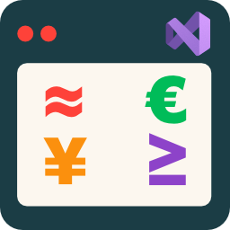

# 🚀 QuickChars



A Visual Studio Code extension that provides quick access to special characters, symbols, emojis, and code snippets through a convenient sidebar panel.

If you enjoy this extension, you can:

  <a href="https://www.buymeacoffee.com/ottojimb">
    
  </a>

## ✨ Features

- **⚡ Quick Character Insertion**: Insert special characters and symbols with a single click
- **📝 Code Snippets**: Insert predefined code snippets with placeholders
- **📁 Collapsible Groups**: Organize items into groups that can be expanded/collapsed
- **💾 Persistent State**: Groups remember their expanded/collapsed state between sessions
- **🔄 Dual Panel Support**: Available in both Activity Bar and Explorer sidebar
- **🎨 Fully Customizable**: Configure your own groups and items through VS Code settings

## 📦 Default Groups

QuickChars comes with these pre-configured example groups:

- **🔤 Special Characters**: Arrows, copyright, checkmarks, currency symbols, mathematical operators
- **🇪🇸 Spanish Accents**: Accented letters and Spanish punctuation (¿, ¡)
- **😀 Emojis**: Common emojis for documentation and comments
- **💻 Code Snippets**: Console.log and arrow function templates

## 🎯 How to Use

1. **📍 Access the Panel**: Look for the QuickChars icon in the Activity Bar or Explorer sidebar
2. **✨ Insert Items**: Click any button to insert the character or snippet at your cursor position
3. **📂 Expand/Collapse Groups**: Click on group headers to show/hide their contents
4. **🔕 Hide Info Banner**: Uncheck "Show Info Banner" in settings once you're familiar with the extension

## ⚙️ Customization

### 📝 Adding Your Own Groups and Items

1. Open VS Code Settings (`Ctrl/Cmd + ,`)
2. Search for "QuickChars"
3. Edit the "Groups" configuration

### 📋 Configuration Format

```json
{
  "quickChars.groups": [
    {
      "name": "My Custom Group",
      "items": [
        { "label": "✓", "text": "✓" },
        { "label": "My Snippet", "text": "console.log('$1');", "isSnippet": true }
      ]
    }
  ]
}
```

### 🔧 Configuration Example

```json
{
  "quickChars.groups": [
    {
      "name": "Math Symbols",
      "items": [
        { "label": "α", "text": "α" },
        { "label": "π", "text": "π" }
      ]
    },
    {
      "name": "JS Snippets",
      "items": [
        { "label": "Log", "text": "console.log('$1');", "isSnippet": true }
      ]
    }
  ]
}
```

### 🏷️ Item Properties

- `label`: Text displayed on the button
- `text`: Text to be inserted
- `isSnippet` (optional): Set to `true` for full-width snippet buttons

### 📝 Placeholder Support

- `$1`, `$2`, etc. for tab stops
- `${1:placeholder}` for default text
- `$0` for final cursor position

## 🎮 Commands

- **QuickChars: Toggle QuickChars in Activity Bar** - Show/hide the Activity Bar panel
- **QuickChars: Toggle QuickChars in Explorer** - Show/hide the Explorer panel

## 💡 Tips

- 💾 Groups remember their expanded/collapsed state - your preferred layout persists between sessions
- 📄 Use `isSnippet: true` for multi-line code templates that need full-width buttons
- 🔲 Regular characters work best as square buttons without the `isSnippet` property
- 🔄 You can completely replace the default configuration with your own groups
- 🏠 The first group is expanded by default, others start collapsed

## 📋 Requirements

- Visual Studio Code 1.102.0 or higher

## ⚡ Extension Settings

This extension contributes the following settings:

* `quickChars.showInfoBanner`: Enable/disable the configuration tips banner
* `quickChars.showInActivityBar`: Show/hide QuickChars in Activity Bar
* `quickChars.showInExplorer`: Show/hide QuickChars in Explorer
* `quickChars.groups`: Define your custom groups and items

## 📄 License

This extension is provided as-is without warranty. Feel free to modify and distribute according to your needs.
